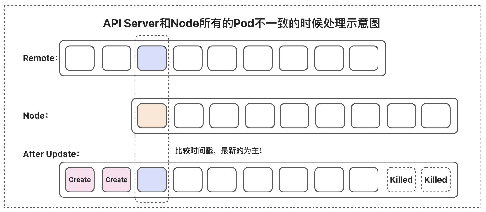
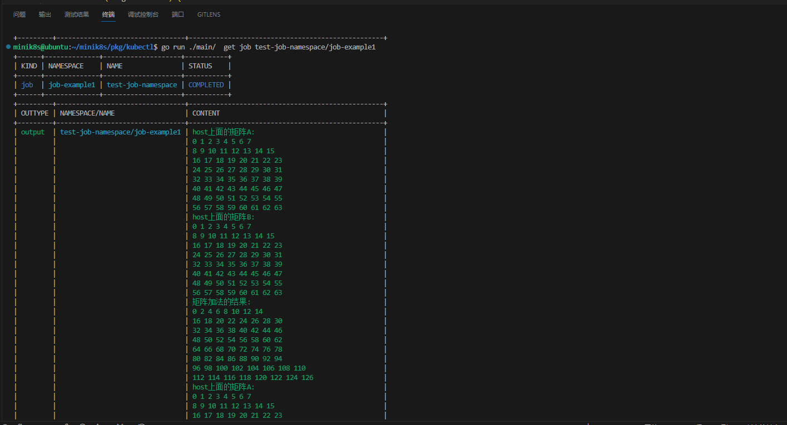
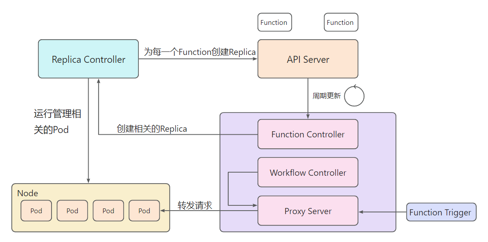

# Minik8s
 
 >  2023年《SE3356 云操作系统设计与实践》课程第一小组项目，简易的[Kubernetes](https://kubernetes.io/zh-cn/)容器编排工具，通过go语言实现。

 <p align="center">
    <a href="https://minik8s.ayaka.space" target="_blank" rel="noopener noreferrer">
        
    </a>
</p>

<p align="center"><b>minik8s</b> 简易的容器编排工具 </p>

<p align="center">
<a href="https://github.com/Musicminion/minik8s"></a>
<a href="https://github.com/Musicminion/minik8s"></a>
<a href="https://github.com/Musicminion/minik8s"></a>
<a href="https://wakatime.com/badge/github/Musicminion/minik8s"></a>
<br />
<a href="https://minik8s.ayaka.space">在线文档</a>
<a href="https://minik8s.ayaka.space">演示视频</a>
<a href="https://gitee.com/Musicminion/miniK8s">Gitee镜像仓库</a>
<a href="https://github.com/miniK8s">Github组织</a>
</p>
 

## 项目贡献

小组成员如下：

| 姓名   | 学号         | 邮箱                                                         | 成员 | 贡献度 |
| ------ | ------------ | ------------------------------------------------------------ | ---- | ------ |
| 董云鹏 | 517021910011 | [@dongyunpeng-sjtu](https://github.com/dongyunpeng-sjtu)     | 组长 | 30%    |
| 冯逸飞 | 520030910021 | [@every-breaking-wave](https://github.com/every-breaking-wave) | 组员 | 35%    |
| 张子谦 | 520111910121 | [@Musicminion](https://github.com/Musicminion)               | 组员 | 35%    |

详细分工：


项目仓库的地址：

- Github: https://github.com/Musicminion/minik8s/
- Gitee: https://gitee.com/Musicminion/miniK8s

项目文档的在线网站

- 文档仓库：https://github.com/minik8s/minik8s-docs
- 文档地址：https://minik8s.ayaka.space

项目的CI/CD主要在Github上面运行，所以如有需要查看，请移步到Github查看。


## 项目管理与开发

### 使用到的开源库

- [github.com/docker/docker](https://github.com/moby/moby) 底层容器运行时的操作
- [github.com/pallets/flask](https://github.com/pallets/flask) Serveless容器内的运行的程序
- [github.com/gin-gonic/gin](https://github.com/gin-gonic/gin) APIServer框架
- [github.com/fatih/color](https://github.com/fatih/color) minik8s的分级日志系统
- [github.com/klauspost/pgzip](https://github.com/klauspost/pgzip) 用户文件的zip压缩
- [github.com/melbahja/goph](https://github.com/melbahja/goph) GPU Job的SSH的客户端
- [github.com/mholt/archiver](https://github.com/mholt/archiver) Docker镜像打包时用到的tar压缩
- [go.etcd.io/etcd/client/v3](https://github.com/etcd-io/etcd) 和Etcd存储交互操作的客户端
- [gopkg.in/yaml.v3](https://gopkg.in/yaml.v3) go的yaml文件解析
- [gotest.tools/v3](https://github.com/gotestyourself/gotest.tools) 项目测试框架
- [docker/login-action](https://github.com/docker/login-action) CICD自动推送镜像到dockerHub
- [docker/setup-qemu-action ](https://github.com/docker/setup-qemu-action)CICD交叉编译平台
- [github.com/google/uuid](https://github.com/google/uuid) API对象UUID的生成
- [github.com/spf13/cobra](https://github.com/spf13/cobra) Kubectl的命令行工具
- [github.com/jedib0t/go-pretty/table](https://github.com/jedib0t/go-pretty/table) Kubectl美化输出
- [github.com/coreos/go-iptables/iptables](https://github.com/coreos/go-iptables/) 封装了对iptables的修改操作

### 架构

**开发语言**：Golang。我们项目主要采用go语言(版本1.20)进行开发。之所以选择go语言，因为docker、k8s也是基于go开发的，并且docker提供了go相关的sdk，让我们轻松就能将项目接入，实现通过go语言来操作底层的容器运行、获取运行状态等信息。另外go语言本身具有很好的容错能力，通过强制检查返回值`err`的方式，也让错误报错更加友好。

**项目架构**：我们的项目架构学习了K8s的架构，同时又适应需求做了一定的微调。整体主要是由：控制平面和Worker节点的两大类组成。运行在控制平面的组件主要有下面的几个：

- API Server：提供一系列Restful的接口，例如对于API对象的增删改查接口，供其他组件使用
- Controller：包括DNS Controller、HPA Controller、Replica Controller、JobController，主要是对于一些抽象级别的API对象的管理，状态的维护。
- Scheduler：负责从所有的可以使用的节点中，根据一定的调度策略，当收到Pod调度请求时，返回合适的节点
- Serveless：单独运行的一个服务器，负责维护Serveless的函数相关对象的管理，同时负责转发用户的请求到合适的Pod来处理
- RabbitMQ：作为消息队列，集群内部的进程间通讯工具

运行在WorkerNode上面的主要有下面的几个组件

- kubeproxy：负责DNS、Iptable的修改，维护Service的状态等
- Kubelet：维护Pod的底层创建，Pod生命周期的管理，Pod异常的重启/重建等
- Redis：作为本地的缓存Cache，哪怕API-Server完全崩溃，因为有本地的Redis，机器重新启动之后，Kubelet也能够恢复之前容器的状态


### 项目管理

**项目分支**：我们的开发采用多分支进行。每一个功能点对应一个Feature分支(对于比较复杂的功能分支可能会有不同组员自己的Branch)，所有的推送都会经过`go test`的测试检验。并可以在[这里](https://github.com/Musicminion/minik8s/actions)查看详细的情况。

项目一共包含主要分支包括

- Master分支：项目的发行分支，**只有通过了测试**, 才能通过PR合并到Master分支。
- Development分支：开发分支，用于合并多个Feature的中间分支，
- Feature/* 分支：功能特定分支，包含相关功能的开发分支

如下图所示，是我们开发时候的Pr合并的情况。所有的Pr都带有相关的Label，便于合并的时候审查。考虑到后期的合并比较频繁，我们几乎都是每天都需要合并最新的工作代码到Development分支，然后运行单元测试。测试通过之后再合并到Master分支。


**CI/CD介绍**：CI/CD作为我们软件质量的重要保证之一。我们通过Git Action添加了自己的Runner，并编写了项目的测试脚本来实现CI/CD。保证每次运行前环境全部初始化。

- 所有的日常代码的推送都会被发送到我们自己的服务器，运行单元测试，并直接显示在单次推送的结果后方
- 当发起Pr时，自动会再一次运行单元测试，测试通过之后才可以合并
- 运行单元测试通过之后，构建可执行文件，发布到机器的bin目录下
- 以上2,3条通过之后，对于合并到Master的情况，会构建docker相关的镜像(例如GPU Job的docker镜像、Function的基础镜像)推送到dockerhub

**软件测试介绍**：go语言自身支持测试框架。并且鼓励把项目文件和测试文件放在同一个文件夹下面。例如某一个项目的文件是file.go,那么测试的文件的名字就是file_test.go。最终要运行整个项目测试的时候，只需要在项目的根目录运行 `go test ./...` 即可完成整个项目的测试。测试会输出详细的测试通过率，非常方便。

**功能开发流程**：

- 我们的软件开发基于迭代开发、敏捷开发。小组成员每天晚上在软件学院大楼实验室集中进行开发新功能，减少沟通障碍，做到有问题及时解决、沟通，有困难相互请教，这也大大的提高了我们小组的效率。截止15周周末，我们已经完成了所有的功能的开发。基本符合预期进度。
- 对于新功能开发，我们采用"动态分配"方法，根据进度灵活分配成员的任务。项目框架搭建好之后，基本上在任何时间点小组同时在开发两个或者两个以上的需求。一人开发完成之后，交给另外一个组员完成代码的审查和测试，测试通过之后合并到Master
- 功能开发的过程主要是：简要的需求分析->设计API对象->设计API-Server的接口->设计Etcd存储情况->编写该需求的运行逻辑代码->编写Kubectl相关代码->最终测试
- 具体如下图所示，在整个开发的流程中，我们基本都是在重复下面的流程图。


- 当然我们在开发的过程中也在及时更新文档，如下图所示，是我们的API-Server的详细接口文档，便于组员之间了解对方的开发情况


**开发简介**：

- 项目代码体量大约2w行代码，开发周期大约1.5月
- 完成要求里面的全部功能

## 组件详解

### API Server

**API-Server**：API Server是minik8s控制平面的核心。主要负责和etcd存储交互，并提供一些核心的APIObject的API，供其他组件使用。在设计API Server的API时候，我们主要考虑了两个特性，一个是状态(Status)和期望(Spec)分离的情况，另外一个是Etcd的路径和API分离。

如果没有分离，我们考虑下面的情景：当一个Kubelet想要更新某一个Pod的状态的时候，试图通过Post或者Put请求写入一个完整的Pod对象，在此之前,假如用户刚刚通过`kubectl apply`更新了一个Pod的信息，如果按照上面我所叙述的时间线，就会出现用户的apply的更新的Pod被覆盖了。同样的道理，如果用户删除了一个Pod，按照上面的设计，Kubelet在回传的时候写入了一个完整的Pod，相当于没有做任何的删除。

虽然说上面的例子是因为期望和状态没有分离，但是本质是Kubelet的权限太大，能够写入一个完整的Pod。所以为了解决这种问题，我们对于一个对象，往往设计了更新对象接口(更新整个对象)，更新对象的状态接口(仅仅更新Status，如果找不到对象那么就不更新)

第二个设计时分开了API的格式和Etcd存储API对象的路径。Etcd存储API对象的路径都是诸如`registry/pods/<namespace>/<name>`，而API的格式大多都是`/api/v1/pods/namespaces/:namespace/name/:name`,可以看到两者的差别还是比较明显的，这是因为API版本看发生动态变化(在实际的k8s中也是这样)，但是存储的路径保证兼容原来的。所以在我们的minik8s中，我们同样借鉴了这样的思路。

更多有关API-Server的内容以及详细的API文档，请移步到`/pkg/apiserver`下的Readme查看。

### Kubelet架构

**Kubelet**：Kubelet是和容器底层运行交互的组件，确保每一个Pod能够在该节点正常运行。目前Kubelet架构设计如下(我们参考了k8s的反馈路径设计并做了一定的微调，以适应项目)

- Kubelet主要由：StatusManager、RunTimeManager、PlegManager、WorkerManager几个核心组件和Pleg、MsgChan的通道组成。
- RunTimeManager和底层的Docker交互，用于创建容器、获取容器运行的状态、管理镜像等操作
- WorkerManager用于管理Worker，我们的策略是每一个Pod分配一个Worker，然后由WorkerManager进行统一的调度和分配。每一个Worker有他自己的通道，当收到Pod的创建或者删除任务的时候，就会执行相关的操作
- PlegManager用来产生Pleg(Pod LifeCycle Event)，发送到PlegChan。PlegManager会调用StatusManager，比较缓存里面的Pod的情况和底层运行的Pod的情况，产生相关的事件。
- ListWatcher会监听属于每个Node的消息队列，当收到创建/删除Pod的请求的时候，也会发送给相关的WorkerManager
- 也就是说创建Pod会有消息队列/StatusManager检测到和远端不一致这样两种路径，前者的效率更高，后者用于维护长期的稳定。两者协同保证Pod的正确运行


具体来说，各个组件之间的行为和关系如下图详细所示。

- Runtime Manager会负责收集底层正在运行的所有的容器的信息，并把容器的信息组装为Pod的状态信息。同时收集当前机器的CPU/内存状态，把相关的信息回传到API Server，及时更新。
- Status Manager还会定期的从API Server拉取当前节点上所有的Pod，以便于比较和对齐，产生相关的容器生命周期事件(Pleg)，
- Status Manager对于所有更新获取到的Pod，都会写入Redis的本地缓存，以便于API-Server完全崩溃和Kubelet完全崩溃重启的时候，Kubelet有Pod的期望信息，能够作为对齐目标
- 当出现Pod不一致的时候，以远端的API-Server的数据为主，并清除掉不必要的Pod。如下图所示，会清空不必要的Pod，并创建本地没有的Pod，实现和远端数据的对齐。




### controller架构

minik8s需要controller对一些抽象的对象实施管理。Controller是运行在控制平面的一个组件，具体包括DNS Controller、HPA Controller、Job Controller、Replica Controller。之所以需要Controller来对于这些API对象进行管理，是因为这些对象都是比较高度抽象的对象，需要维护已有的基础对象和他们之间的关系，或者需要对整个系统运行状态分析之后再才能做出决策。具体的逻辑如下：

- Replica Controller：维护Replica的数量和期望的数量一直，如果出现数量不一致，当通过标签匹配到的Pod数量较多的时候，会随机的杀掉若干Pod，直到数量和期望一致；当通过标签匹配到的Pod数量偏少的时候，会根据template创建相关的Pod
- Job Controller：维护GPU Job的运行，当一个新的任务出现的时候，会被GPU JobController捕捉到（因为这个任务没有被执行，状态是空的），然后Controller会创建一个新的Pod，让该Pod执行相关的GPU任务。
- HPA Controller：分析HPA对应的Pod的CPU/Mem的比例，并计算出期望的副本数，如果当前副本和期望数量不一致，就会触发扩容或者缩容。所有的扩容、缩容都是以一个Pod为单位进行的，并且默认的扩容/缩容的速度是15s/Pod。如果用户自己指定了扩缩容的速度，那么遵循用户的规则。
- DNS Controller：负责nginx service的创建，同时监听Dns对象的变化，当有Dns变化时会向所有的node发送hostUpdate以更新nginx的配置文件和hosts文件

### Kubectl

Kubectl是minik8s的命令行交互工具，命令的设计基本参考kubernates。我们使用了Cobra的命令行解析工具，大大提高了命令解析的效率。


支持的命令如下所示：

- `Kubectl apply ./path/to/your.yaml` 创建一个API对象，会自动识别文件中对象的Kind，发送给对应的接口
- `Kubectl delete ./path/to/your.yaml` 根据文件删除一个API对象，会自动识别文件中对象的name和namespace，发送给对应的接口(删除不会校验其他字段是否完全一致)
- `kubectl get [APIObject] [Namespace/Name]` 获取一个API对象的状态(显示经过简化的信息，要查看详细的结果，请使用Describe命令)
- `kubectl update [APIObject] ./path/to/your.yaml`, 更新一个API对象，会自动识别文件中对象的name和namespace，发送给对应的接口
- `kubectl describe [APIObject] [Namespace]/[Name]` 获取一个API对象的详细的json信息(显示完整的经过优化的json字段)
- `kubectl execute [Namespace]/[FunctionName] [parameters]` 触发一个Serveless的函数，并传递相关的参数，返回执行结果

另外，我们对所有指令的输出都进行了美化，并根据API对象的不同对输出内容进行了调整，以下为示例输出：


### Scheduler

Scheduler是运行在控制平面负责调度Pod到具体Node的组件。Scheduler和API-Server通过RabbitMQ消息队列实现通讯。当有Pod创建的请求的时候，API-Server会给Scheduler发送调度请求，Scheduler会主动拉取所有Node，根据最新的Node Status和调度策略来安排调度。

目前我们的Scheduler支持多种调度策略：

- RoundRobin：轮询调度策略
- Random：随机调度策略
- LeastPod：选择Pod数量最少的节点
- LeastCpu：选择CPU使用率最低的作为调度目标
- LeastMem：选择Mem使用率最低的作为调度的目标

这些调度策略可以通过启动时候的参数进行指定。


### Kubeproxy

Kubeproxy运行在每个Worker节点上，主要是为了支持Service抽象，以实现根据Service ClusterIP访问Pod服务的功能，同时提供了一定负载均衡功能，例如可以通过随机或者轮询的策略进行流量的转发。同时Kubeproxy还通过nginx实现了DNS和转发的功能。

目前Kuberproxy设计如下：

- Kuberproxy主要由IptableManager、DnsManager两个核心组件和serviceUpdateChan、DnsUpdateChan的通道组成。
- 当Kubeproxy启动后会向API-Server发送创建nginx pod的请求，并在之后通过nginx pod来进行反向代理
- IptableManager用于处理serviceUpdate, 根据service的具体内容对本机上的iptables进行更新，以实现ClusterIP到Pod的路由。
- DnsManager用于处理hostUpdate，这是来自DnsController的消息，目的是通知节点进行nginx配置文件和hosts文件的更新，以实现DNS和转发功能，不过由于实现上的考虑不足，DnsManager的这部分功能由Kubeproxy直接承担了。

## 需求实现详解

### Pod抽象

Pod是k8s(minik8s)调度的最小单位。用户可以通过 `Kubectl apply Podfile.yaml` 的声明式的方法创建一个Pod。当用户执行该命令后，Kubectl会将创建Pod的请求发送给API-Server。API-Server检查新创建的Pod在格式、字段是否存在问题，如果没有异常，就会写入Etcd，并给Scheduler发送消息。

Scheduler完成调度之后，会通过消息队列通知API-Server，API-Server收到调度结果，将对应的Pod的nodename字段写入调度结果，然后保存回Etcd。然后主动给相关的Kubelet发送Pod的创建请求。

之前已经介绍到Kubelet创建Pod可以有两条途径，一条是长期拉取自己节点所有的Pod，另外一条途径是收到消息队列的创建请求之后主动创建。我们经过多次测试保证这两条途径**不会冲突**，因为在WorkManager底层是每一个Pod对应一个Worker，一旦收到了创建请求，再次收到创建请求的时候就会被忽略。Kubelet收到创建Pod请求之后，会把Pod的配置信息写入到本地的Redis里面，这样即使是API-Server崩溃，Kubelet出现重启，也能够保证Pod的信息可以读取到。

Pod创建之后，Kubelet的Status Manager会不断监视Pod的运行状态，并将状态更新写回到API-Server(通过Pod的Status的接口)。如果Pod中的容器发⽣崩溃或⾃⾏终⽌，首先PlegManager会通过StatusManager捕捉到Pod的异常状态，然后会产生Pod生命周期时间，通过PlegChan发送需要重启Pod的命令。然后WorkerManager收到之后会执行重启的操作。

pod内需要能运⾏多个容器，它们可以通过localhost互相访问。这一点我们是通过Pause容器实现的。将Pod相关的容器都加入pause容器的网络名字空间，这样就能实现同一个Pod里面的容器的通讯。至于PodIP的分配，我们使用了Weave网络插件，保证多机之间PodIP唯一的分配。

特别感谢[这篇文章](https://k8s.iswbm.com/c02/p02_learn-kubernetes-pod-via-pause-container.html)的精彩讲解，让我们了解了实现Pod内部容器的通讯。

具体创建Pod的时序图如下所示。


以下为示例yaml文件：

````yaml
apiVersion: v1
kind: Pod
metadata:
  labels:
    app: service
  name: pod-example1
  namespace: default
spec:
  containers:
    - image: registry.cn-hangzhou.aliyuncs.com/tanjunchen/network-multitool:v1
      name: test1
      ports:
        - containerPort: 80
      resources:
        requests:
          memory: 100000000      # 单位为byte
        limits:
          memory: 200000000
    - image: musicminion/func-base
      name: test2
      ports:
        - containerPort: 18080
    - image: docker.io/library/redis
      name: test3
      command: ["sh", "-c", "redis-server --appendonly yes"]
````

使用方法：

`kubectl apply pod.yaml`

### CNI Plugin

Minik8s⽀持Pod间通信，我们组选择了Weave网络插件，只需要通过简单的`weave launch`和`weave connect`等命令，就可以将一个节点加入到Weave网络集群里面。Weave插件会将容器与特定的IP绑定关联（`weave attach`命令绑定容器到Weave网络），实现多个Pod之间的通讯。同时Weave具有比较智能的回收功能，一旦某个容器被删除，相关的IP也会被回收，供下次再分配。

### Service抽象

在Kubernetes中，应用在集群中作为一个或多个Pod运行, Service则是一种暴露网络应用的方法。在我们的设计里，Service被设计为一个apiObject, 用户可以通过 `Kubectl apply Servicefile.yaml `的声明式的方法创建一个Service。

在Kubernetes中，部分pod会有属于自己的Label，这些pod创建时，API-Server会基于标签为它们创建对应的endpoint。当我们创建sevice时，会根据service的selector筛选出符合条件的endpoint，并将service和这些endpoint打包在一起作为serviceUpdate消息发送到所有Node的kubeproxy。

我们选择使用Iptables来实现proxy功能。当Kubeproxy收到service的更新消息后，会依据service和endpoint的ip信息更新本地的iptables，具体的更新方法参照了[这篇文章](https://www.bookstack.cn/read/source-code-reading-notes/kubernetes-kube_proxy_iptables.md), 出于简化的目的我们删去了一些规则，最终Iptables的设计如下：


此时访问service的规则流向为：
`PREROUTING --> KUBE-SERVICE --> KUBE-SVC-XXX --> KUBE-SEP-XXX`

Service和Pod的创建没有先后要求。如果先创建Pod，后创建的Service会搜索所有匹配的endpoint。如果先创建Service，后创建的pod创建对应的endpoint后会反向搜索所有匹配的Service。最终将上述对象打包成serviceUpdate对象发送给kubeproxy进行iptables的更新。

以下为示例yaml文件：

```yaml
kind: Service
apiVersion: v1
metadata:
  name: service-example
  namespace: default
spec:
  ports:
    - name: http
      port: 88	      # service的端口
      targetPort: 80  # 匹配的pod暴露的端口
      protocol: tcp
  selector:
    app: service
```

使用方法：

`kubectl apply service.yaml`

### DNS与转发

为了实现通过域名直接访问minik8s上service的功能，我们需要实现DNS与转发功能。这一部分由DNSController与Kubeproxy协作完成。

当Kubeproxy启动时，会向API-Server发送一个创建nginx pod的请求，当DNSController启动时，会向API-Server发送一个创建nginx service的请求。当用户创建dns对象后，API-Server会通知DNSController，DNSController会根据创建的dns的信息为nginx生成一份配置文件，示例如下：

```
server {
        listen 80;
        server_name test.com;                             # nginx service的域名
        location /service1 {
                proxy_pass http://192.168.160.168:88/;    # 匹配的service的clusterIP
        }
        location /service2 {
                proxy_pass http://192.168.121.186:88/;
        }
}
```

此外，DNSController还会维护一个域名到ip的map，域名由dns指定，ip则是nginx的clusterIP。接着，DNSController会将以上信息发送给所有的Kubeproxy，Kubeproxy收到消息后，会进行hosts文件的更新，以便实现DNS功能，同时向nginx pod的挂载目录写入新的配置文件，并让nginx pod执行`nginx -s reload`命令，由此使得配置文件的更新生效。

这样，所有对以上域名的访问都会被变成对nginx service的访问，通过nginx service相关的iptables设置，流量会被转发到nginx pod上，之后nginx pod将会根据配置文件和子路径的匹配，将流量转发到对应的service的clusterIP上，从而实现了DNS与转发功能。

另外，为了实现pod内部也能正常地使用DNS服务，我们必须要使pod的hosts文件与节点上的保持一致，为了实现这一点有以下做法：

- 定期同步node与其上所有pod的hosts文件
- 在pod创建时或者dns更新时同步hosts文件
- 使所有的pod均挂载/etc/hosts目录

以上实现均可行，我们选择了第一种做法。

以下为示例yaml文件：

```yaml
apiVersion: v1
kind: Dns
metadata:
  name: test-dns
spec:
  host: test.com
  paths:
  - subPath: /api/v2           # 子路径
    svcName: service-example
    svcPort: 88

```

使用方法：在nginx pod与nginx service创建好之后，使用以下命令：

`kubectl apply dns.yaml`

### ReplicaSet抽象

ReplicaSet可以用来创建多个Pod的副本。我们的实现是通过ReplicaSet Controller。通常来说创建的ReplicaSet都会带有自己的ReplicaSetSelector，用来选择Pod。ReplicaSet Controller会定期的从API-Server抓取全局的Pod和Replica数据，然后针对每一个Replica，检查符合状态的Pod的数量。如果数量发现小于预期值，就会根据Replica中的Template创建若干个新的Pod，如果发现数量大于预期值，就会将找到符合标签的Pod删去若干个(以达到预期的要求)

至于容错，我们放在了底层的Kubelet来实现。Pleg会定期检查运行在该节点的所有的Pod的状态，如果发现Pod异常，会自动重启Pod，保证Pod的正常运转。

以下为示例yaml文件：

```yaml
apiVersion: v1
kind: Replicaset
metadata:
  name: testReplica
spec:
  replicas: 3
  selector:
    matchLabels:
      labelkey1: labelvalue1
  template:
    metadata:
      name: replicaPod
      labels:
        labelkey1: labelvalue1
    spec:
      containers:
      - name: testContainer-1
        image: docker.io/library/nginx
        ImagePullPolicy: IfNotPresent

```

使用方法:

`kubectl apply replicaset.yaml`

### 动态伸缩

为了实现对Pod的动态伸缩控制，我们实现了HPA（Horizontal Pod  Autoscaler）对象,  它选择Pod作为Workload，通过Selector筛选出对应Pod后，监测这些Pod的资源指标（在我们的实现中是CPU和Memory）并进行动态伸缩。

我们使用HPAController进行HPA对象与相应Pod的管理，HPAController会定期的从API-Server抓取全局的Pod和HPA数据，然后针对每一个HPA对象，检查它匹配的Pod的资源指标，并基于特定算法（具体算法见[Horizontal Pod Autoscaling](https://kubernetes.io/docs/tasks/run-application/horizontal-pod-autoscale/)）计算出Pod的期望数量，然后将Pod的实例数向期望数量调整。简单来说，当Pod的平均资源使用量超标时则会扩容以降低平均平均负载，反之则会缩容。另外为了避免副本数变化过快，我们还进行了相应的速度限制。

我们直接通过docker client提供的接口抓取container的实时指标，并通过StatusManager定期的回传任务将指标写入到etcd的podStatus中，以下为实现动态伸缩的架构图：


HPA匹配Pod的容错同样交给了Kubelet来维持，因此HPAController只需要负责监测与调整即可。

以下为示例yaml文件：

```yaml
apiVersion: v1
kind: Hpa
metadata:
  name: test-hpa
spec:
  minReplicas: 2
  maxReplicas: 5
  workload:       
    kind: Pod             # hpa作用的的对象：Pod
    metadata:
      name: test-pod
      namespace: test-namespace
  adjustInterval: 15s     # 扩缩容的速度限制
  selector:
    matchLabels: 
      app: hpa
  metrics:
    cpuPercent: 0.35	  # 期望的平均cpu利用率
    memPercent: 0.5		  # 期望的内存利用率
```

使用方法：

创建hpa对应的pod之后，执行以下命令：

`kubectl apply hpa.yaml`


### GPU Job

GPU任务本质是通过Pod的隔离实现的。我们自己编写了[GPU-Job-Server](https://hub.docker.com/r/musicminion/minik8s-gpu)，并发布了arch64和arm64版本的镜像到Dockerhub。GPU-Job-Pod启动的时候，会被传递Job的namespace和name，该内置的服务器会主动找API-Server下载任务相关的文件和配置信息，根据用户指定的命令来生成脚本文件。

然后，GPU-Job-Server会使用用户提供的用户名、密码登录到交大的HPC平台，通过slurm脚本提交任务，然后进入等待轮寻的状态。当任务完成之后，会将任务的执行的结果从HPC超算平台下载，然后上传给API-Server，到此为止一个GPU的Job全部完成。

我们编写了简易的并行矩阵加法和乘法函数。时序图如下所示。


使用CUDA编程的情况下，我们首先定义了matrix_add和matrix_multiply两个使用__global__标记的核函数，矩阵加法和矩阵乘法使用的是正常的操作。为了显示出区别，A\[i]\[j]和B\[i]\[j]没有初始化成一样的数据，而是初始化成不同的数据，这样得到的C\[ i ][ j ]能够检验我们的工作是否是正确的。

CUDA的风格类C，所以在处理矩阵这样的二维数组时需要两重指针，在进行host内存和device内存之间的数据转移。

```  cuda
cudaMemcpy((void *)dev_A, (void *)host_A, sizeof(int *) * M, cudaMemcpyHostToDevice);

cudaMemcpy((void *)dev_B, (void *)host_B, sizeof(int *) * M, cudaMemcpyHostToDevice);

cudaMemcpy((void *)dev_C, (void *)host_C, sizeof(int *) * M, cudaMemcpyHostToDevice);
```

这里的cudaMemcpy函数作用是拷贝一段连续的内存，所以无法处理二重指针，需要辅助指针dev_A,dev_B和dev_C，也就是说我们共需要四类指针，host上的二重和一重指针，device上的二重和一重指针。


最终输出的效果如下所示：


示例yaml文件：

```yaml
apiVersion: v1
kind: Job
metadata:
  name: job-example1
  namespace: test-job-namespace
spec:
  partition: dgx2
  nTasks: 1
  nTasksPerNode: 6
  submitDirectory: "change-me"
  runCommands: [
    "module load cuda/9.2.88-gcc-4.8.5",
    "nvcc matrix_add.cu -o matrix_add",
    "nvcc matrix_multiply.cu -o matrix_multiply",
    "./matrix_add",
    "./matrix_multiply",
  ]
  outputFile: "job-example1.out"
  errorFile: "job-example1.err"
  username: "change-me"
  password: "change-me"
  gpuNums: 1
```

使用方法：

`kubectl apply job.yaml`

### Serverless

Serverless功能点主要实现了两个抽象：Function和Workflow抽象，Function对应的是用户自己定义的python函数，而Workflow对应的是讲若干个Funcion组合起来，组成的一个工作流。工作流支持判断节点对于输出的结果进行判断，也支持路径的二分叉。

实现Function抽象我们主要是通过编写了一个自己的[Function-Base镜像](https://hub.docker.com/repository/docker/musicminion/func-base)，该镜像同样支持Arm和X86_64。Function-Base镜像里面是一个简单的Python的Flask的服务器，会实现参数的解析，并传递给用户的自定义的函数。当我们创建一个Function的时候，我们首先需要拉取Function-Base镜像，然后将用户自定义的文件拷贝到镜像里面，再将镜像推送到minik8s内部的镜像中心(该镜像中心是通过docker启动了一个容器实现)，当用户的函数需要创建实例的时候，本质是创建了一个ReplicaSet，用来创建一组Pod，这些Pod的都采用的上述推送到minik8s内部的镜像中心的镜像。

为了方便对于用户云函数请求的统一管理，我们在Serveless的程序里面添加了一个Server(或者理解为Proxy)，当用户要通过统一的接口触发函数的时候，Serveless-Server会在自己的RouteTable里面查找相关函数对应的Pod的IP，然后将请求转发给相关的Pod，处理完成之后返回给用户。如果发现相关的Function对应的Replica数量为0，那么他还会触发Replica Resize的操作，把相关Replica的数量设置为大于0的数量。

显然，如果用户长期没有请求云函数，这个函数对应的Replica一段时间就会数量设置为0。当用户再次请求的时候，由于整个Replica的状态维护是有一个响应链的，数量的修改需要一段时间才能生效，所以不太可能让用户一请求就立马实现冷启动，然后立刻返回处理结果。如果没有实例。只会返回告知用户稍后再来请求，函数实例可能正在创建中。

对于Workflow，我们采用类似的WorkflowController，定期检查API-Server里面的Workflow，如果发现有任务栏没有被执行(也就是对应的Status里面的Result是空)，Workflow Controller就会尝试执行这个工作流。

我们的工作流里面有两类节点，一个对应的是funcNode，也就是说这个节点对应的一个function，这时候Workflow Controller就会将上一步的执行结果(如果是第一个节点那就是工作流的入口参数)发送给对应namespace/name下的function来执行。另外一个类型节点对应的是optionNode，这个节点只会单纯对于上一步的执行结果进行判断。如果判断的结果是真，就会进入到TrueNextNodeName，如果判断的结果是假，就会进入到FalseNextNodeName。

以下为整个serverless的实现框架：


示例yaml文件：

- function.yaml

  ```
  apiVersion: v1
  kind: Function
  metadata:
    name: func1
  spec:
    userUploadFilePath: "/xx/example-1" # 计算任务所在目录
  ```

- workflow.yaml

  ```
  kind: Workflow
  apiVersion: v1
  metadata:
    name: workflow-example
    namespace: default
  spec:
    entryParams: '{"x": 1, "y": 2}'
    entryNodeName: node1
    workflowNodes: 
    - name: node1
      type: func			# 节点类型，func为计算节点，choice为判断节点
      funcData:
        funcName: func2   # x = x + y, y = x - y
        funcNamespace: default
        nextNodeName: node2
    - name: node2
      type: choice
      choiceData:
        trueNextNodeName: node3
        falseNextNodeName: node4
        checkType: numGreaterThan   # if checkVar > 0, goto node3, else goto node4
        checkVarName: y
        compareValue: 0
    - name: node3
      type: func
      funcData:
        funcName: func3    # x = x^2, y = y^2
        funcNamespace: default
    - name: node4
      type: func
      funcData:
        funcName: func1    # x = x - y, y = y - x
        funcNamespace: default
  ```

使用方法：

- 创建function

  `kubectl apply function.yaml`

- 触发对应function

  `kubectl execute [namespace]/[funcname] {args}`

- 创建对应workflow

  `kubectl apply workflow.yaml`

- 查看执行结果

  `kubectl get workflow [namespace]/[workflowname]`

### 非功能需求

#### 容错

我们的容错性体现在以下两个方面：

1. 应对控制面崩溃

   有关pod的信息全部持久化在etcd存储中，有关service的路由配置则持久化在各节点的iptables中，dns的相关配置同样保存在各个节点的相应文件内。
   当整个控制面(包括Apiserver，controller，scheduler)以及各个节点上的组件(包括Kubelet，Kubeproxy)发生崩溃时并不会导致相关数据的丢失，当以上应用重启后，pod与service仍然可以正常访问。

2. 应对主从不一致

   如果由于某些原因导致控制平面与worker节点上的pod状态不一致时，我们以控制平面的状态为准，具体做法如下：

   - Kubelet的StatusManager定期从控制平面拉取最新的pod的状态并持久化在Redis中

   - Kubelet的RuntimeManager定期从实际运行的容器中获取容器状态

   - PlegManager定期比较RuntimeManger与StatusManager获取的pod状态，根据比较结果产生相应事件

     - 删除多余的pod

     - 创建缺少的pod

     - 重启丢失的container

#### 鲁棒性

我们的系统鲁棒性主要体现在可以处理错误输入与错误的文件格式，并设计了十分完善的错误提示，可以处理大小写错误，参数错误，参数丢失等问题，如图所示：


另外对于一些错误的提交也能正确地识别，包括文件格式错误，关键信息缺失或是重复创建等问题，如图所示：


## 对答辩问题的解释

### 问题一

> 关于助教对于我们触发Function的方式有疑问，我们的解释如下：

我们是通过kubectl实现的，kubectl的内部本质是通过发送http请求，触发函数，然后获得结果的。 要理解这个问题就需要详细的讲一讲我们的Serveless的设计的架构。

如下图所示，我们的Serveless主要是通过Serveless这个程序(运行在控制平面的一个进程)实现的，这个程序有下面的两个功能：

- 定期的拉取API-Server的Function的情况，和Function对应的ReplicaSet进行比较，并且记录每一段时间触发函数的数量，如果数量过少为0，那么就会Scale to zero
- 讲Http请求转发给相关的Pod。为了实现触发函数，Kubectl内置了`Execute`命令，这个命令会向Serveless这个程序发送http请求，请求的URL是：`/:funcNamespace/:funcName`



- 如下所示，Kubectl发送请求会指定好对应的Function的Namespace和Name，然后Serverless这个程序内置了一个Server(或者说他的本质是一个Proxy，把来自Kubectl的请求，根据要调用的Function的Namespace和Name，转发给相关函数的Pod)。
- Serverless这个程序内置了一个Server会维护一个RouteTable，记录和一个Function相关的所有的Pod的IP，然后把请求转发给Pod的IP，收到结果之后，然后把函数的处理结果返回给Kubectl。这样用户就可以查看到函数调用的结果
- 如下面的代码所示，是Serverless程序内置的一个服务器，启动的时候暴露相关的接口，供Kubectl调用。

```go
func (s *server) Run() {
	// 周期性的更新routeTable
	go executor.Period(RouterUpdate_Delay, RouterUpdate_WaitTime, s.updateRouteTableFromAPIServer, RouterUpdate_ifLoop)

	// 周期性的检查function的情况，如果有新创建的function，那么就创建一个新的pod
	go s.funcController.Run()

	// 周期性的检查workflow的情况，如果有新创建的workflow，那么就创建一个新的pod
	go s.workflowController.Run()

	// 初始化服务器
	s.httpServer.POST("/:funcNamespace/:funcName", s.handleFuncRequest)
	s.httpServer.GET("/:funcNamespace/:funcName", s.checkFunction)
	s.httpServer.Run(":" + strconv.Itoa(config.Serveless_Server_Port))
}
```

- 在kubectl里面，发送请求的代码如下：

```go
func executeHandler(cmd *cobra.Command, args []string) {
    // 检查用户的传递的参数
	if len(args) <= 1 {
		fmt.Println("missing some parameters")
		fmt.Println("Use like: kubectl execute" + " [namespace]/[name] [parameters]")
		return
	}

	namespace, name, err := parseNameAndNamespace(args[0])
	if err != nil {
		fmt.Println(err)
		return
	}
	if namespace == "" || name == "" {
		fmt.Println("name of namespace or podName is empty")
		fmt.Println("Use like: kubectl execute" + " [namespace]/[name] [parameters]")
		return
	}
	// 解析参数
	jsonString := args[1]
	var jsonData map[string]interface{}
	err = json.Unmarshal([]byte(jsonString), &jsonData)
	if err != nil {
		fmt.Println("解析JSON出错:", err)
		return
	}

	// 向serveless server发送POST请求
    // 组装一个URL，然后发送Post请求，调用函数为netrequest.PostRequestByTarget
	URL := config.GetServelessServerURLPrefix() + "/" + namespace + "/" + name
	code, res, err := netrequest.PostRequestByTarget(URL, jsonData)
	if err != nil {
		fmt.Println(err)
		return
	}
    
    // 根据返回的结果，展示给用户调用的信息
	if code != 200 {
		fmt.Println("execute function failed, code:", code, "msg: ", res.(map[string]interface{})["msg"])
		return
	}
	fmt.Println("execute function success, result:", res)
}
```

### 问题二

> 关于助教对于我们能否通过`curl`命令来触发函数，我们截图如下：

- 如下图所示，是通过curl发送POST请求给Serveless内置的Server，发送的请求体里面包含了json格式的调用参数，返回的结果是执行之后的处理结果。该Function的功能是计算 $x=x-y, y=y-x$，计算结果和返回的一致
- 具体的信息请参考下面的截图


### 问题三

> 关于助教对于我们Scale-to-0之后的，再次冷启动的时候，第一次返回的信息是立刻返回的，而不是等到相关Pod启动之后返回，我们的解释如下：

- Scale-to-0之后，再次恢复原来的Scale这个过程需要一定的时间，可能大概在10s左右或者稍微更长的时间。我们认为如果这个时候直接等待，可能会超过http请求的时间限制，导致用户体验不好，所以我们的设计是返回一个给用户的提示，让用户稍后再主动做请求，而不是完全等待相关的Pod启动之后，再发送请求把结果返回给用户。

### 问题四

> Function对应的Pod是怎么实现的？怎么实现的Scale-to-zero？

- 我们的设计是每一个Function对应一个Replicaset，然后一个Replicaset管理一组相关的Pod。
- 当用户发送调用函数的请求的时候，我们基于Pod的IP，通过控制平面单独运行的Serveless程序内置的Proxy，把请求转发给相关的Pod。由于和Function相关的Pod的数量可能动态更新，所以Proxy内部维护了一张RouteTable，定期从API-Server更新最新的Pod的IP
- Scale-to-zero是通过统计每一个时间段内用户调用函数的请求的数量来实现的，如果一段时间没有调用函数，会把Replicaset的Pod的数量设置为0，这样就可以Scale-to-Zero。同样的道理，当有请求的时候，我们将Replicaset的Pod的数量设置为大于0的数值，就可以实现冷启动

### 问题五

> hpa部分是否实现自定义扩缩容时间？

- 我们首先设定了一个默认得到扩缩容间隔时间(15s，可调节), hpaController每隔这样一段时间就会进行hpa的更新，这个过程中可能会进行扩缩容
- 用户可以在hpa的yaml文件中指定扩缩容间隔时间，实际执行时，如果发现用户的指定时间大于默认时间，则会将该hpa对应的goroutine协程睡眠这个时间差的时间
